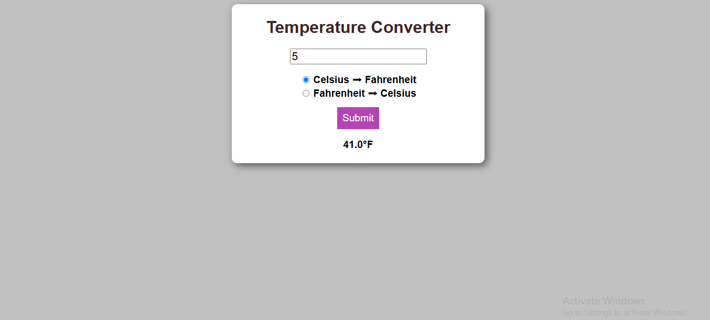

# Temperature Conversion Program

This program allows you to convert temperatures between Celsius and Fahrenheit.

## 🌐 Live Demo

[View the live project here!](https://laibatariq110.github.io/Temperature-Conversion-Program)

## Features

- Converts temperatures from Celsius to Fahrenheit and vice versa.
- Simple user interface.
- Real-time conversion results.

## Usage

1. Open the `index.html` file in a web browser.
2. Enter the temperature value in the input field.
3. Select the desired conversion direction by clicking on the radio buttons:
    - Celsius to Fahrenheit (Celsius ➡ Fahrenheit)
    - Fahrenheit to Celsius (Fahrenheit ➡ Celsius)
4. Click the "Submit" button to see the converted temperature.

## File Structure

- `index.html`: Contains the HTML structure of the program including the form and input elements.
- `style.css`: Contains the CSS styling for the user interface.
- `script.js`: Contains the JavaScript code for handling the temperature conversion logic.

## How It Works

The program takes the temperature input from the user and the selected conversion direction. It then performs the conversion calculation based on the selected option and displays the result.

## Technologies Used

- HTML
- CSS
- JavaScript
